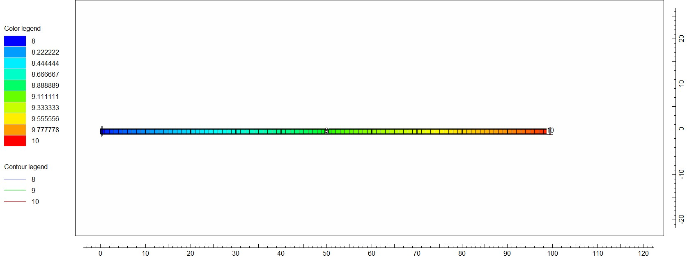
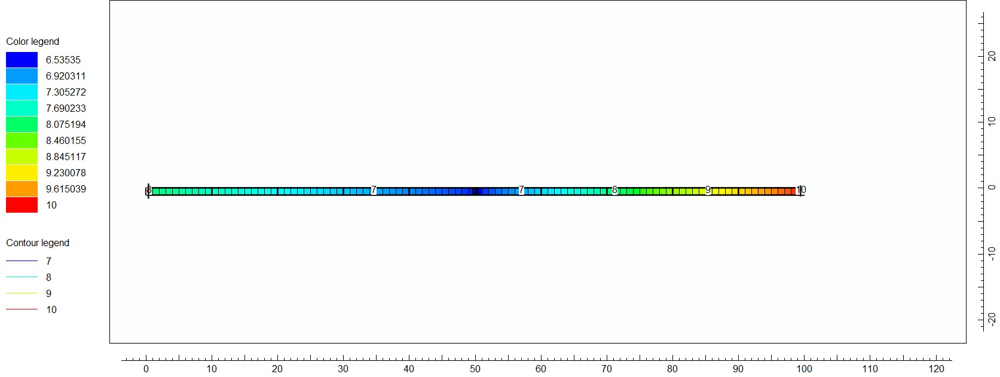
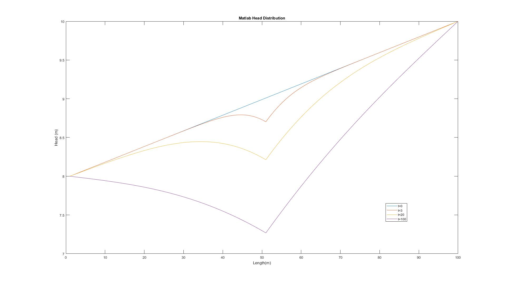

# Groundwater Flow Model

Groundwater Flow Model Characteristics

- 1-D
- 100 meter length
- 1 meter unit width
- 1 meter unit depth
- 0.1 day time step
- Plot distribution at t=0, 3, 20, and 100 days

Aquifer Characteristics

- Steady State
- Confined
- Homogenous
- Isotropic
- Hydraulic Conductivity of 10 meters per day
- Specific Storage of 1 per meter

Pumping Well Characteristics

- Located at center node (50 meters from either side)
- Pumping Rate of 1 m3/day (constant beginning at t=0)

Boundary Conditions

- Constant head of 8 at left boundary
- Constant head of 10 at right boundary

## MATLAB Code

Declare the model characteristics

```m
k = 10;
Ss = 1;
Q = 1;
dx = 1;
dt = 0.1;
duration = 100;
h = zeros(100, 1001);
h(:, 1) = linspace(8, 10, 100);
h(1, :) = 8;
h(100, :) = 10;
n = 98;
h2 = h(2:100, 1);
a = -1;
b = 2 + Ss / k * dx^2 / dt;
c = -1;
beta(1) = b;
```

```m
for j = 2:n
    alpha(j) = a / beta(j - 1);
    beta(j) = b - a * alpha(j);
end
for t = 2:duration / dt + 1
    f = h2;
    f(1) = f(1) + 8;
    f(n) = f(n) + 10;
    f(50) = f(50) - 0.1;
    y(1, 1) = f(1);

    for j = 2:n;
        y(j, 1) = f(j) - alpha(j) * y(j - 1);
    end

    h2(n, 1) = y(n) / beta(n);

    for i = n - 1:-1:1
        h2(i, 1) = (y(i) -c * h2(i + 1, 1)) / beta(i);
    end

    h(2:100, t) = h2;
end
```

Plot the results

```m
plot(1:100, h(:, 1)); hold on;
plot(1:100, h(:, 31)); hold on;
plot(1:100, h(:, 201)); hold on;
plot(1:100, h(:, 1001));
legend('t=0', 't=3', 't=20', 't=100')
xlabel('Length(m)');
ylabel('Head (m)');
title('Matlab Head Distribution')
```

## Results

### Time






### Implicit Difference


